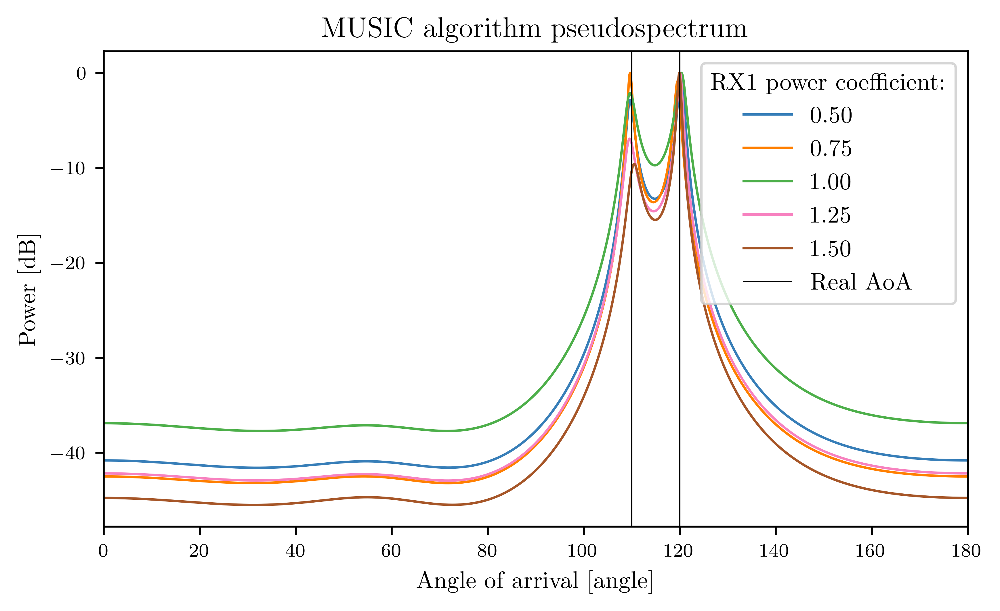

# MUSIC algorithm Angle of Arrival estimation in Python

Parametric analysis of MUSIC algorithm for Angle of Arrival estimation in Python.

 

  - **Initial simulation results - single run**

    
     

  - **Signal to noise ratio sweep**
  
    
     

  - **Snapshot length sweep**
  
    
     

  - **Number of antennas sweep**
  
    
     

  - **Antenna spacing sweep**
  
    
     

  - **RX power difference sweep**
  
    
     
   
 - **Monte Carlo simulation of estimation error vs SNR**

    
     

 - **Monte Carlo simulation of estimation error vs snapshot length**

    
     

 - **Monte Carlo simulation of estimation error vs antenna spacing**

    
     

